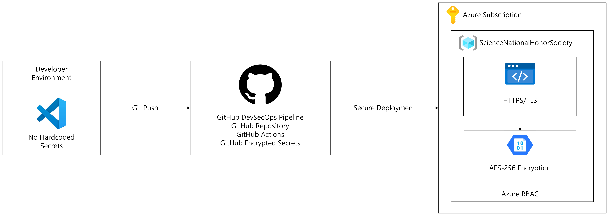

# 🌐 AECHS Science National Honor Society Cloud Infrastructure

**Live Production Website:** [http://bit.ly/AECHS-SNHS-Website](http://bit.ly/AECHS-SNHS-Website)

---

# 📖 Project Overview

This project demonstrates how Microsoft Azure cloud services can be used to solve a real organizational problem through modern cloud architecture and DevOps practices.

I designed and deployed a cloud-hosted website for the Alief Early College High School Science National Honor Society (SNHS) to provide a centralized public presence for students, parents, faculty, and prospective members.

Beyond creating a website, the project serves as a practical demonstration of cloud infrastructure deployment, automated CI/CD pipelines, secure cloud storage, and production-style application lifecycle management.

---

# 🎯 Business Problem

Prior to this project, the organization did not have a public website for sharing announcements, events, officer information, and organizational resources.

Information was distributed across multiple communication channels such in Instagram and Tik Tok, making it more difficult to maintain a consistent public presence and efficiently share updates with students and families.

---

# ✅ Solution

To address this challenge, I designed and implemented a cloud-native solution using Microsoft Azure.

The solution provides:

* A centralized public website
* Automated deployments through GitHub Actions
* Secure cloud-based storage for media assets
* Scalable cloud hosting with built-in HTTPS
* Simplified maintenance through cloud resource organization

---

# ☁️ Azure Architecture

This solution was built using the following Microsoft Azure services.

| Azure Service             | Purpose                                                                |
| ------------------------- | ---------------------------------------------------------------------- |
| **Azure Static Web Apps** | Hosts the web application with global distribution and automatic HTTPS |
| **Azure Blob Storage**    | Stores images and media separately from application code               |
| **Azure Resource Groups** | Logically organizes Azure resources for simplified management          |
| **GitHub Actions**        | Automates build and deployment after code changes are committed        |

---

# 🏗 Cloud Architecture



---

# 💼 Business Impact

This project demonstrates how cloud technologies can improve operational efficiency for a small organization by:

* Establishing a centralized online presence
* Improving communication with students, parents, and faculty
* Reducing manual website deployment tasks through automation
* Separating application code from media assets for easier maintenance
* Providing a scalable architecture that can evolve as organizational needs grow

---

# ⚙️ Technical Skills Demonstrated

## Cloud Infrastructure

* Microsoft Azure resource provisioning
* Azure Static Web Apps deployment
* Azure Blob Storage configuration
* Azure Resource Group management
* Static website hosting architecture

## DevOps

* Continuous Integration (CI)
* Continuous Deployment (CD)
* GitHub Actions workflow automation
* Git version control
* Repository management
* Deployment monitoring and troubleshooting

## Front-End Development

* HTML5
* CSS3
* JavaScript
* Responsive web design
* Cross-browser compatibility

---

## 🔒 Security, Governance & Compliance Controls

This project implements cloud security best practices to protect organizational resources, secure the deployment process, and safeguard data through identity management, encryption, and secure credential handling.

### 🆔 Identity & Access Management (IAM)
* **Principle of Least Privilege (PoLP):** Access permissions are scoped to minimize unnecessary privileges. Azure RBAC is applied at the Resource Group level to ensure users receive only the permissions required to manage assigned resources.
* **Role-Based Access Control (RBAC):** Administrative access to Azure resources is controlled through Azure RBAC, allowing authorized users to manage resources while preventing unauthorized changes.

### 🔑 Secure Credential Management
* **Zero Hardcoded Secrets:** No API keys, deployment tokens, or credentials are stored within the source code or configuration files.
* **GitHub Encrypted Secrets:** Azure deployment credentials are securely stored as GitHub Encrypted Secrets and injected into the GitHub Actions workflow only during deployment.
* **Scoped Deployment Access:** The Azure Static Web Apps deployment token is scoped specifically to the application resource, reducing unnecessary permissions and supporting the principle of least privilege.

### 🛡️ Data Protection & Encryption
* **Encryption in Transit:** HTTPS is enforced across all endpoints using Azure-managed TLS certificates, protecting data exchanged between users and Azure services.
* **Encryption at Rest:** Azure Blob Storage uses Azure Storage Service Encryption (SSE) with Microsoft-managed AES-256 encryption to automatically protect stored data.
* **Resource Segmentation:** Separating the web application from Azure Blob Storage isolates static content delivery from the application layer, reducing the attack surface and improving maintainability.

### 🌐 Network Security
* **Secure Service Communication:** All communication between users and Azure-hosted services is encrypted using HTTPS, ensuring secure data transmission.

### 🔍 Monitoring & Operational Security
* **Deployment Traceability:** Source changes are tracked through Git version control, while automated deployments through GitHub Actions provide deployment history and auditability.

---

# 🏛 Engineering Decisions

| Decision              | Reason                                                                              |
| --------------------- | ----------------------------------------------------------------------------------- |
| Azure Static Web Apps | Serverless hosting with automatic HTTPS and global availability                     |
| Azure Blob Storage    | Separates media assets from application code for easier maintenance and scalability |
| GitHub Actions        | Automates deployments after every code commit                                       |
| Azure Resource Groups | Simplifies management and organization of Azure resources                           |

---

# 📂 Repository Structure

```text
SNHS/
├── .github/
│   └── workflows/
│       └── azure-static-web-apps-*.yml   # GitHub Actions CI/CD workflow
│
├── index.html                            # Main application entry point
├── README.md                             # Project documentation
├── learning-progress.md                  # Project development notes
```

---

# 🚀 Future Enhancements

Planned improvements include:

* Infrastructure as Code (Terraform)
* Azure Monitor for application monitoring and diagnostics
* Azure Key Vault for centralized secret management
* Performance monitoring and analytics

---

# 🎓 Learning Outcomes

This project strengthened my practical experience with:

* Microsoft Azure cloud services
* Cloud architecture design
* DevOps automation
* Git and GitHub workflows
* Cloud resource management
* Production deployment practices
* Technical documentation
* Problem-solving through cloud technology

---

## Author

**Peter Nguyen**

Cloud Engineering | Microsoft Azure | DevOps | Infrastructure Automation

This repository is part of my cloud engineering portfolio and demonstrates practical experience designing, deploying, and maintaining cloud-hosted applications using Microsoft Azure.